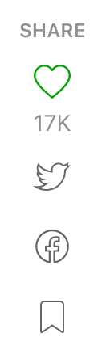

# Refined Medium 

🤖 Chrome extension that removes the pestering share widget and signup bars on Medium.com so you can focus on the article. Reader View in Safari is a wonderful alternative to this extension, but then you have to use Safari...So until Chrome implements similar functionality, Refined Medium is here to help 😗

## License

MIT
